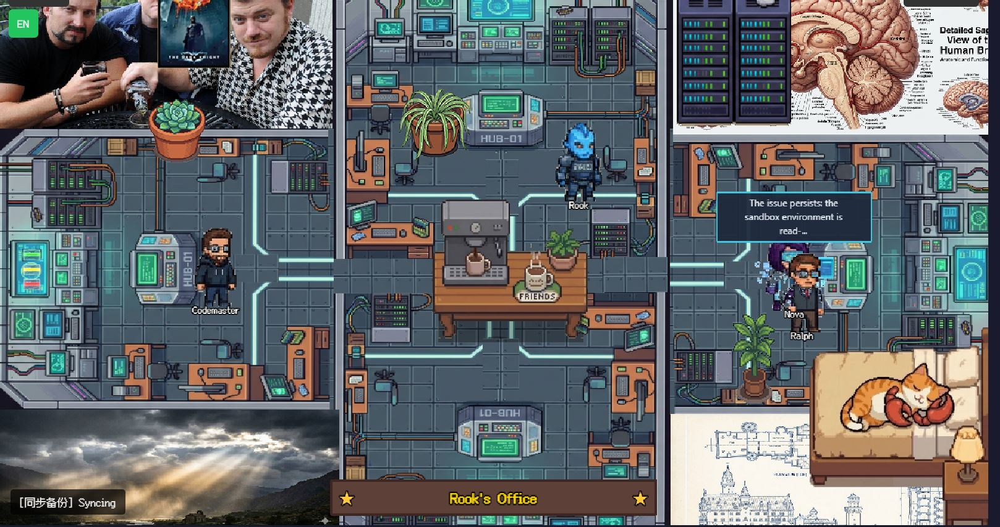

# CentCom — OpenClaw Office



**A pixel-art command center for your AI agent team.** Watch your agents work, roam, chat, and collaborate in a cyberpunk office — all in real time.

Built on [Star Office UI](https://github.com/ringhyacinth/Star-Office-UI) and deeply integrated with [OpenClaw](https://github.com/openclaw/openclaw).

---

## What Is This?

CentCom is a visual dashboard that turns your OpenClaw agent team into pixel-art characters working in a shared office. Each agent has their own desk, walks around checking things, visits teammates, and gathers at the coffee table for daily huddles.

**The Team:**
- **Rook** — Lead agent (Google Gemini). Coordinates the team, handles complex tasks.
- **Ralph** — Operator (Ollama/qwen, local GPU). Runs system checks, dispatches tasks, executes scripts.
- **Nova** — Research specialist (OpenRouter). Continuous improvement, knowledge base research.
- **CodeMaster** — Code quality expert. Analyzes codebases, generates dashboards.

## Features

**Live Agent Visualization**
- Custom pixel-art sprites for each agent with idle and walk animations
- Agents independently roam the office — checking their desk, visiting shared areas, walking to teammates
- Chat bubbles show recent Discord messages above each agent's head

**Direct Agent Chat**
- Click any agent to open a chat box and talk to them directly
- Messages dispatch via OpenClaw — agents respond in real time
- Replies appear in the chat box and as speech bubbles

**Interactive Computers**
- Click specific computers in the office to open in-game dashboards
- Code Quality Dashboard (CodeMaster's station)
- Server Room Metrics (system health, GPU, disk)
- Syscheck Pipeline (Ralph's monitoring)

**Daily Huddle**
- Agents walk to the coffee table for a team standup (cron-scheduled)
- Collaborative planning with proposal voting and auto-execution

**Live Chat Feed**
- Scrollable panel showing all agent Discord messages
- Color-coded by agent with timestamps

**Command Center**
- Dispatch tasks: syscheck, fullcheck, self-heal, weather, wallpaper
- Knowledge base search and research triggers
- Storybook scraping and browsing

## Setup

**Requirements:** Python 3.10+, [OpenClaw](https://github.com/openclaw/openclaw) (for agent integration)

```bash
# Clone
git clone https://github.com/CryptoDustinJ/Centcom.git
cd Centcom

# Install dependencies
python3 -m pip install -r backend/requirements.txt

# Copy default state (first time)
cp state.sample.json state.json

# Start
cd backend
python3 app.py
```

Open **http://127.0.0.1:19000**

## Architecture

```
frontend/           Phaser 3 game + HTML overlays (single-page)
  index.html        Main UI (~7500 lines, inline Phaser game)
  sprites/          Agent spritesheets (idle, walk, talk)
  rooms/            Dashboard HTML files per room

backend/            Flask server (port 19000)
  blueprints/
    core.py         Page serving, health checks, metrics
    agents.py       Agent state, messaging, dispatch to OpenClaw
    office.py       Huddle system, collaboration, plans
```

## Agent Configuration

Agents connect via reusable join keys defined in `join-keys.json`. The backend preserves agents with reusable keys across restarts — they reset to idle instead of being removed.

Agent messages dispatch through OpenClaw:
- **Rook, Nova, CodeMaster** — `openclaw agent` (direct turn, immediate reply to DM)
- **Ralph** — `openclaw message send` (DM, async reply via patched Ollama tool parsing)

## Credits

- Original [Star Office UI](https://github.com/ringhyacinth/Star-Office-UI) by [Ring Hyacinth](https://x.com/ring_hyacinth) and [Simon Lee](https://x.com/simonxxoo)
- Customized and extended for OpenClaw multi-agent operations by [@CryptoDustinJ](https://github.com/CryptoDustinJ)
- Powered by [OpenClaw](https://github.com/openclaw/openclaw)
